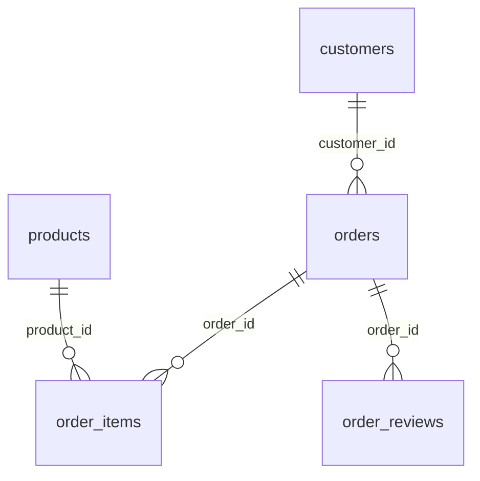

# E-commerce Sales and Delivery Analysis
**Status: starter project / work in progress.** The workflow is implemented; real-data results and business recommendations have not yet been produced.

## Business question
Which product categories and regions drive sales, and where are delivery problems associated with weaker customer reviews?

## Data
Download the [Brazilian E-Commerce Public Dataset by Olist](https://www.kaggle.com/datasets/olistbr/brazilian-ecommerce) and extract its CSV files into `data/raw/`. Keep original filenames. Follow the dataset's license and attribution requirements; raw data is not included in this repository.

Required files: orders, order_items, customers, products, and order_reviews CSVs (each prefixed `olist_` and suffixed `_dataset.csv`).

## Run
Install Python 3.10 or newer. This project uses SQLite through Python's standard library; no extra packages or database server are required.

From this repository's folder:
```sh
python run.py
```
The command builds `data/portfolio.sqlite` and exports query results into `results/`. Review `data_quality.csv` before interpreting the other outputs. Re-running replaces these generated files.

## SQL skills
Joins, CTEs, CASE expressions, window functions, grouped metrics, date calculations, and table-grain validation.

## Questions and outputs
- `01_monthly_sales.sql`: monthly delivered-order sales, order count, average order value, and change from the prior observed month.
- `02_category_sales.sql`: product-category sales and rankings.
- `03_delivery_reviews.sql`: late-delivery rate by customer state, with review scores split by delivery status.
- `00_data_quality.sql`: duplicate keys and missing/unmatched data checks.

## Metric definitions
Sales = sum of item prices for delivered orders, excluding freight; this is merchandise value in BRL, not profit or Olist's platform revenue.
Average order value = merchandise value / delivered orders with item records.
Late = actual delivery calendar date after estimated delivery calendar date. Rate denominator includes only delivered orders with both dates.
Review score = first averaged within each order, then averaged across reviewed orders.
The monthly comparison uses the prior observed month; investigate missing months and incomplete boundary months before treating it as month-over-month growth.

## Table relationships

Item totals and reviews are aggregated to one row per order before joining. This avoids multiplying sales when an order has several items or reviews. Customer and product keys must be unique.

## Finish the portfolio case study
1. Download the data and run the workflow.
2. Investigate every nonzero quality check; document exclusions or repairs.
3. Reconcile item sales against order totals.
4. Build three charts from the output CSVs (Excel, Power BI, or Tableau).
5. Complete [the findings worksheet](docs/findings.md) with actual numbers and limitations.
6. Add chart images and a concise business recommendation to this README.

Delivery and review relationships are observational, not evidence that lateness alone caused a rating change. Dataset history is not a statement about current market conditions.
