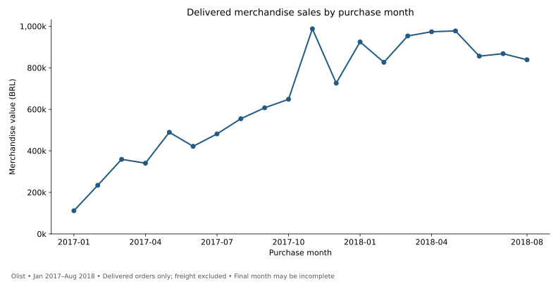
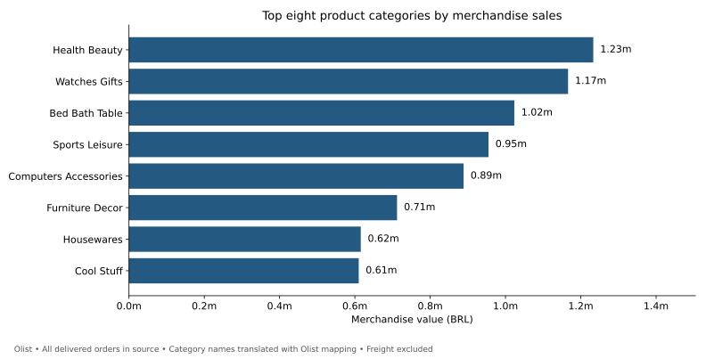
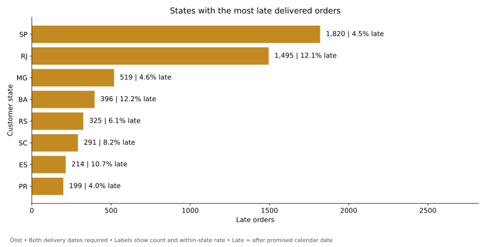
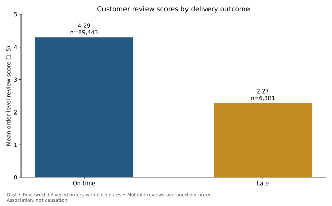
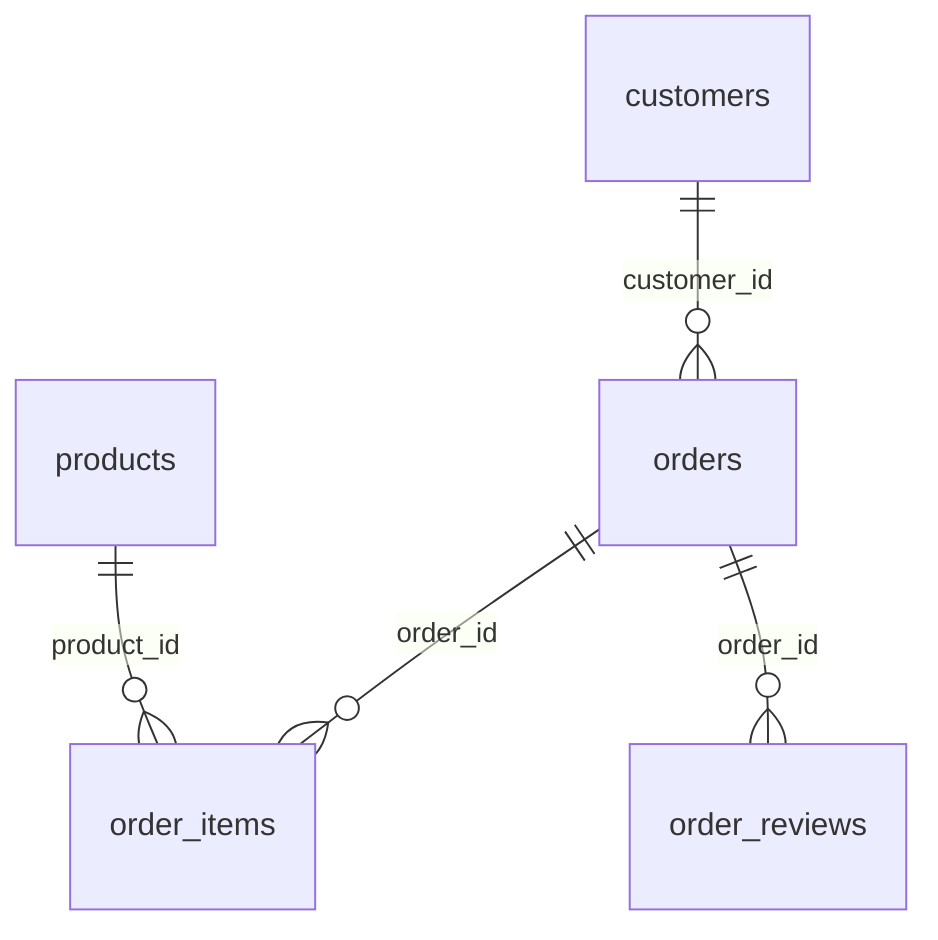

# E-commerce Sales & Delivery Performance

A completed SQL portfolio case study using **99,441 real Olist orders** to examine merchandise sales, delivery reliability, and customer reviews.

**Main finding:** late deliveries represent 6.77% of eligible delivered orders and have an average review score of 2.27/5, compared with 4.29/5 for on-time deliveries. This is an association, not a causal estimate.

## Business decision
Where should an e-commerce operations team investigate delivery problems, while monitoring sales performance?

**Recommended starting point:** investigate delivery lanes serving Rio de Janeiro (RJ): 1,495 late orders among 12,350 eligible deliveries (12.11%). Sao Paulo (SP) has more late orders (1,820), but a lower rate (4.49% across 40,494 deliveries). Examine both operational volume and failure rate before allocating resources.

## Results at a glance

| Metric | Result | Definition |
|---|---:|---|
| Delivered orders | 96,478 | Delivered status with item records |
| Merchandise value | R$13,221,498.11 | Sum of delivered item prices; excludes freight |
| Average order value | R$137.04 | Merchandise value / delivered orders |
| Late delivery rate | 6.77% | 6,534 / 96,470 delivered orders with both dates |
| Late-order review score | 2.27 / 5 | 6,381 reviewed late orders |
| On-time review score | 4.29 / 5 | 89,443 reviewed on-time orders |

### Sales pattern


The reviewed trend peaks in November 2017 at R$987,765.37. The chart shows January 2017–August 2018 to avoid sparse opening months. The final month may be incomplete; no causal event or current-market inference is attached to the pattern.

### Product mix


Health & Beauty leads with R$1,233,131.72. The five largest categories contribute 39.83% of delivered merchandise value. Sales do not establish profitability because product costs and marketplace commissions are unavailable.

### Delivery priorities


State abbreviations follow Brazil's standard state codes. Full state metrics, including small-volume states, remain in the result table. RJ combines substantial volume and a rate above the overall 6.77%; SP remains important because its absolute late-order count is largest.

### Customer experience


62.36% of reviewed late orders have an order-average score of 2 or less, versus 9.23% of reviewed on-time orders. Product mix, sellers, geography, review timing, and customer selection may also explain differences.

## Explore the work
- [Executed analysis notebook](analysis.ipynb)
- [Detailed findings and recommendations](docs/findings.md)
- [Methods and data quality](docs/methodology.md)
- [Interview walkthrough](docs/interview-guide.md)
- [Aggregate result tables](results/)
- [Validation record](docs/validation.md)
- [Python customer case study](https://github.com/raeparrishprogit/python-customer-analysis)

## Reproduce
Python 3.12 was used. From the repository folder:

```sh
python -m pip install -r requirements.txt
python download_data.py
python build_portfolio.py
```

The final command rebuilds SQLite tables, executes all seven SQL files, independently reconciles key metrics with pandas, and regenerates aggregate CSVs and SVG/PNG charts. Open `analysis.ipynb` in Jupyter or VS Code and run all cells to rebuild its outputs. For only the SQL outputs, `python run.py` uses Python's standard library.

## SQL implementation
Seven focused queries demonstrate joins, CTEs, CASE expressions, date functions, grouped metrics, window functions, and validation. Item prices and reviews are aggregated before joining where required to preserve order grain. Indexes accelerate joins; duplicate customer, product, and order keys stop the build.



## Source and scope
[Olist Brazilian E-Commerce Public Dataset](https://www.kaggle.com/datasets/olistbr/brazilian-ecommerce), downloaded October 1, 2026. Source orders span September 4, 2016–October 17, 2018. Olist's category translation file supplies chart labels. The dataset is historical; results describe this extract, not today's business. See the source's CC BY-NC-SA 4.0 terms for data reuse. Raw data is not redistributed here; fingerprints are in `results/summary.json`.

Prepared with AI assistance; calculations were executed and checked against the full source data. This is an independent portfolio case study, not paid work for Olist or a claim of implemented business impact.
